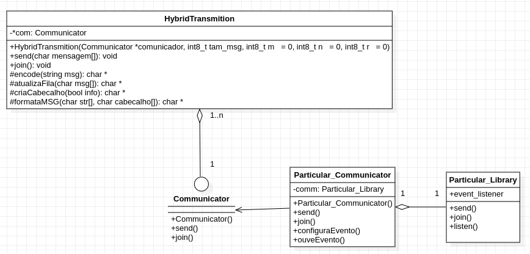
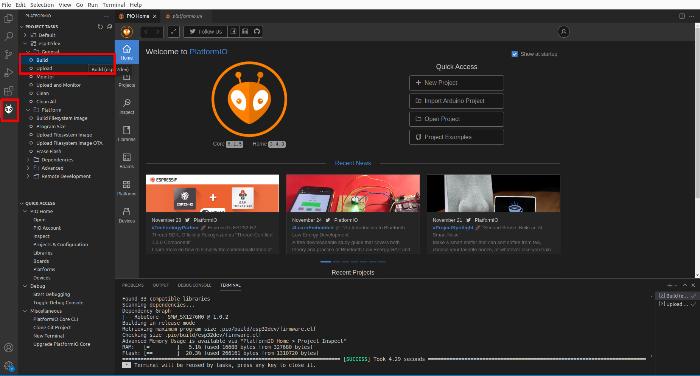

# Hybrid Transmission Protocol — Firmware (ESP32)

This directory contains an firmware implementation of the **Hybrid Transmission (HT)** protocol for embedded devices based on ESP32 with LoRaWAN communication.

HT is a protocol that increases communication reliability by using both message repetition and erasure-coded messages, which allow for recovering lost packets.

> 📚 This implementation is based on the article:  
> J. M. d. S. Sant’Ana, A. Hoeller, R. D. Souza, S. Montejo-Sánchez, H. Alves, and M. d. Noronha-Neto,  
> "*Hybrid Coded Replication in LoRa Networks,*"  
> *IEEE Transactions on Industrial Informatics*, vol. 16, no. 8, pp. 5577–5585, 2020.  
> DOI: [10.1109/TII.2020.2966120](https://doi.org/10.1109/TII.2020.2966120)

---

## 🛠️ Implementation

This implementation uses an **ESP32 Dev Module** connected to a **LoRaWAN Bee V2** module.

The LoRa communication is handled using the library provided by RoboCore:  
[RoboCore_SMW-SX1276M0](https://github.com/RoboCore/RoboCore_SMW-SX1276M0)

Messages are transmitted to [The Things Network (TTN)](https://www.thethingsnetwork.org/), which acts as a LoRaWAN gateway and application server.

---

## 📐 Protocol Header Structure

The figure below shows the structure of the HT protocol header:

.svg)

In this example, the 13th message is being transmitted. It is of type “information,” with 5 repetitions, a coding window of 4 messages, and 3 coded message transmissions.

---

## 📊 UML Diagram

The class structure used in the firmware is shown in the following diagram:



---

## ▶️ How to Build and Upload

To compile and upload the firmware, follow these steps:

1. Clone this repository:
   ```bash
   git clone https://github.com/your-user/your-repo.git
   ```

2. Open the project folder in **Visual Studio Code**.

3. Install the **PlatformIO IDE** extension.

4. If PlatformIO does not initialize properly, try restarting VSCode a few times.

5. In the PlatformIO menu, run the **Build** task:

   

6. Connect your **ESP32 Dev Module** via USB and run the **Upload** task.

7. When the message `Connecting...` appears in the terminal, briefly press the **BOOT** button on the ESP32.  
   ⚠️ **Note**: Do not hold the button for more than a few seconds, or the device may reset.
